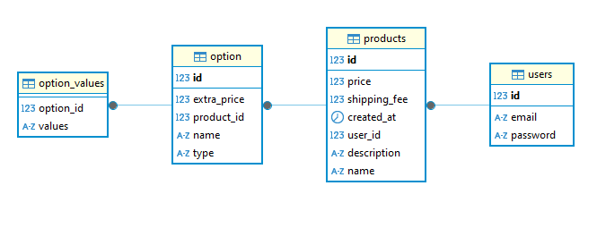

# 접속 링크: http://54.162.118.28:8080/

# 🛒 상품 및 옵션 관리 시스템

## 📌 프로젝트 개요
Spring Boot 기반의 **상품 및 옵션 관리 시스템**으로, 사용자는 OAuth2 로그인을 통해 상품과 옵션을 관리할 수 있습니다.  
주요 기능으로는 **상품 및 옵션의 CRUD, 페이징 처리, JWT 인증, 예외 처리, 로깅 및 API 테스트** 등이 포함됩니다.

---

## 🚀 주요 기능
### 🔑 **회원 관리 (로그인)**

- **JWT 토큰 기반 인증 및 인가**
- **로그인한 사용자만 상품 및 옵션 관리 가능**

### 🛍 **상품 (Product) 관리**
- **상품 등록** (로그인한 사용자만 가능)
- **상품 목록 조회** (최신순, 페이징 적용)
- **상품 수정 및 삭제** (본인이 등록한 상품만 가능)
- **페이징 처리** (한 페이지당 기본 5개)

### 🎛 **옵션 (Option) 관리**
- **상품당 최대 3개의 옵션 추가 가능**
- **옵션 CRUD 기능 제공**
- **옵션 타입**:
    - **입력형 (INPUT)**: 사용자가 직접 입력하는 옵션
    - **선택형 (SELECT)**: 미리 정의된 값 중 선택 가능
- **옵션 값 저장 구조**:
    - **입력형**: 선택지 없음
    - **선택형**: 여러 개의 선택지 저장 가능

## **ERD**

  
## 🛠 사용 기술
- **Spring Boot 3** - 웹 애플리케이션 프레임워크
- **Spring Security** - 인증 및 인가 관리
- **Spring Data JPA** - ORM 기반 데이터 관리
- **Thymeleaf** - 서버 사이드 템플릿 엔진
- **JUnit 5** - 단위 및 통합 테스트  

## **상품 API**
- **POST /api/products** - 새로운 상품을 등록합니다.
- **GET /api/products?page={page}&size={size}** - 페이징된 상품 목록을 조회합니다.
- **GET /api/products/{productId}** - 특정 상품의 상세 정보를 조회합니다.
- **PUT /api/products/{productId}** - 특정 상품의 정보를 수정합니다.
- **DELETE /api/products/{productId}** - 특정 상품을 삭제합니다.

## **옵션 API**
- **POST /api/options** - 특정 상품에 옵션을 추가합니다.
- **GET /api/options/{productId}** - 특정 상품에 등록된 옵션 목록을 조회합니다.
- **PUT /api/options/{optionId}** - 특정 옵션을 수정합니다.
- **DELETE /api/options/{optionId}** - 특정 옵션을 삭제합니다.